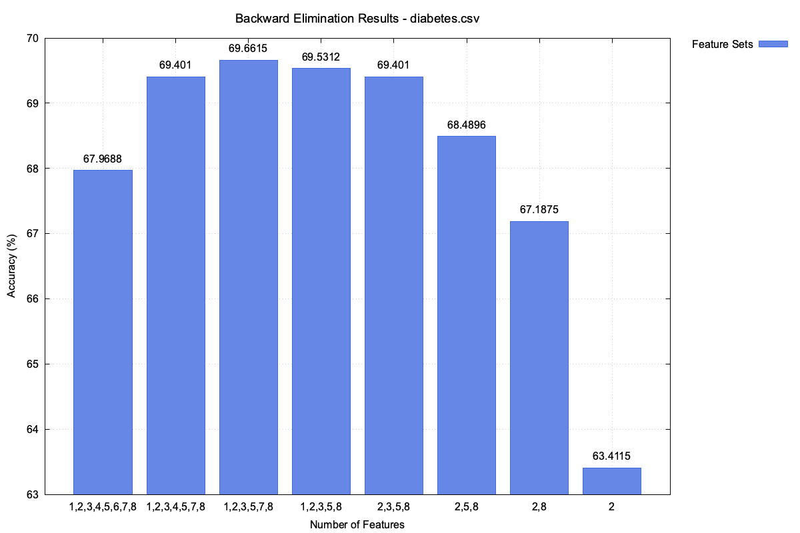

# CS205-KNN

## Overview

- This project is done for Project 2 of CS205
- This project includes the implementation of Forward Search Algorithm and Backward Search Algorithm
- It outputs the best set for predicting the result

## File Desciption

- feature_selection.cpp
  - Forward selection, Backward selection.
- knn_utils.cpp
  - It has helper functions for feature selection.
- plot_utils.cpp
  - It makes plots.
- main.cpp
  - Driver file.

## How To Execute

`g++ -std=c++11 -o feature_selection_app main.cpp feature_selector.cpp knn_utils.cpp plot_utils.cppy`

## Performance Comparison

